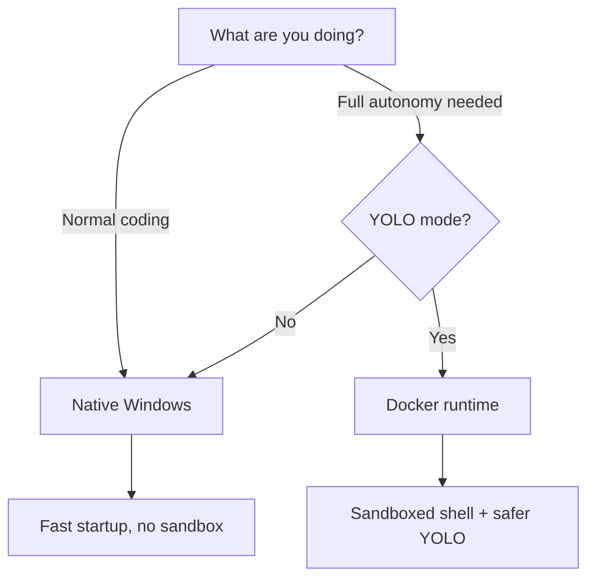
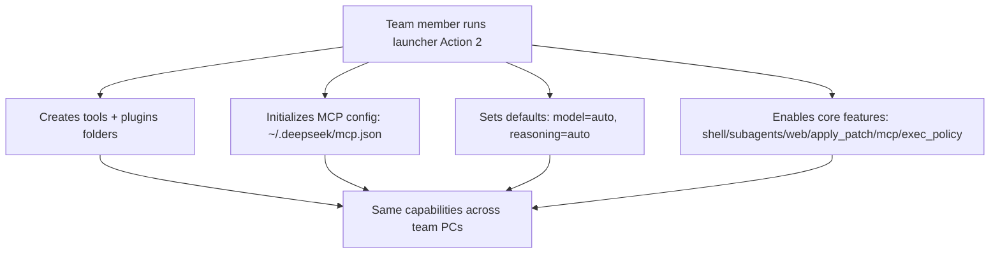

# DeepSeek TUI — Team Setup Guide

> **One launcher, three choices, zero commands to memorize.**
> Follow these steps exactly and you'll be coding with DeepSeek V4 in 10 minutes.

---

## ⚡ Kun Jo — Quick Start (Skip to This)

Kun Jo, here's all you need — copy these 4 lines into PowerShell, one by one:

```powershell
npm install -g deepseek-tui
deepseek auth set --provider deepseek
git clone https://github.com/sakimotto/deepseek-tui.git
powershell -File "deepseek-tui\launch.ps1"
```

Then pick:
- **2** (Setup this PC) — first time only
- **4** (Login) — paste your DeepSeek API key
- **1** (Launch) — every day after setup

That's it. If anything goes wrong, pick **3** (Doctor) and send me the output. — [Hmbown](https://github.com/sakimotto)

---

## Before You Start

You need these on your PC:

| Requirement | How to check | Install if missing |
|---|---|---|
| **Windows 10/11 (x64)** | `winver` in Start menu | — |
| **Node.js 18+** | `node --version` in PowerShell | https://nodejs.org (LTS) |
| **Git** | `git --version` in PowerShell | https://git-scm.com/download/win |
| **PowerShell 5.1+** | Built into Windows | — |
| **Docker Desktop** *(optional, for YOLO sandbox)* | `docker --version` | https://www.docker.com/products/docker-desktop/ |

Quick check — open PowerShell and run:

```powershell
node --version
git --version
```

Both should print a version number (e.g. `v20.11.0`). If either says "not recognized", install it from the links above.

---

## Step 1: Install DeepSeek TUI

Open **PowerShell** (right-click Start → Windows PowerShell) and run:

```powershell
npm install -g deepseek-tui
```

Wait for the download to finish (it pulls the Rust binaries — about 50 MB). Then verify:

```powershell
deepseek --version
```

You should see something like:

```
deepseek (npm wrapper) v0.8.28
binary version: v0.8.28
```

> **China users:** if npm is slow, add `--registry=https://registry.npmmirror.com` to the install command.

---

## Step 2: Get Your API Key

You need a DeepSeek API key to use the agent. There are two ways:

### Option A: Team lead gives you a key

Your team lead will provide a key. Once you have it:

```powershell
deepseek auth set --provider deepseek
```

Paste the key when prompted. It's saved securely to `C:\Users\YOU\.deepseek\config.toml`.

### Option B: Create your own key

1. Go to https://platform.deepseek.com/api_keys
2. Sign up / log in
3. Click **Create new API key**
4. Copy the key (starts with `sk-`)
5. Run `deepseek auth set --provider deepseek` and paste it

> **Never share your key** — it is tied to your billing account.

---

## Step 3: Verify Everything Works

```powershell
deepseek doctor
```

You should see:

```
API Connectivity:
  provider: deepseek
  base_url: https://api.deepseek.com/beta
  model: deepseek-v4-pro
  Testing connection...
  API connection successful
```

If you see **"API connection successful"**, you're ready. If not, check the [Troubleshooting](#troubleshooting) section below.

---

## Step 4: Clone the Team Launcher Repo

Clone this anywhere — once only:

```powershell
git clone https://github.com/sakimotto/deepseek-tui.git
```

This gives you:
- `launch.ps1` — Interactive picker (works from ANY project folder)
- `launch.bat` — Double-click shortcut
- `.env.example` — Environment template
- `docs/TEAM_GUIDE.md` — This guide

---

## Step 5: Launch (in YOUR project)

### The workflow — every time

```powershell
# 1. Go to YOUR project (whatever you're working on)
cd C:\Users\YOU\Projects\my-app

# 2. Launch DeepSeek TUI — either way:
deepseek --model auto                           # Quick way, no menu
powershell -File C:\path\to\deepseek-tui\launch.ps1   # Full menu picker
```

The launcher now works from **any folder**. It shows which workspace you're in
at the top, so you always know which project the agent sees.

### Step 5a: Alias for one-command launch (do once)

From any project folder, you can launch with just **two letters**. Run this ONCE:

```powershell
$profileDir = Split-Path $PROFILE -Parent
if (-not (Test-Path $profileDir)) { New-Item -ItemType Directory -Path $profileDir -Force }
Add-Content -Path $PROFILE -Value 'function ds { powershell -File "D:\OneDrive - Zervi Asia Co., Ltd\Desktop\Git-Projects\httpsgithub.comHmbownDeepSeek-TUI.git\DeepSeek-TUI\launch.ps1" }'
```

Close PowerShell and reopen. Now from **any folder**, just type:

```powershell
ds
```

The menu opens. Pick and go. No paths, no cd, no memorization.

### Easy way (recommended)

Navigate to any project in File Explorer, then double-click `launch.bat`
from wherever you saved it. The TUI opens with that project as the workspace.

You'll see an action menu first:

```
  Pick an action:
    1. Launch TUI
    2. Setup this PC (recommended first run)
    3. Doctor (verify setup)
    4. Login / change API key
    5. Update deepseek
```

On your first run on a new PC, pick **2** (Setup). After that, pick **1** (Launch).

When you pick Launch, you'll see three simple questions:

```
  ========================================
       DeepSeek TUI Launcher
  ========================================

  Pick a mode:
    1. Plan   - Read-only, explore only (press Tab in TUI)
    2. Agent  - Interactive, asks before running
    3. YOLO   - Auto-approve everything (use Docker)

  Enter 1, 2, or 3

  Pick runtime:
    N. Native  - Instant, no Docker needed
    D. Docker  - Sandboxed, safe for YOLO

  Enter N or D

  Pick a model:
    A. Auto   - Let DeepSeek choose per turn
    P. Pro    - deepseek-v4-pro (best quality)
    F. Flash  - deepseek-v4-flash (fast & cheap)

  Enter A, P, or F
```

| You pick | What you get |
|----------|-------------|
| `2` `N` `A` | **Agent mode, native, auto model** — best for daily work |
| `1` `N` `A` | Agent mode then press Tab for Plan — safe exploration |
| `3` `D` `P` | YOLO mode, Docker sandbox, Pro model — full autonomy |

---

## Diagrams (How It All Fits Together)

### Diagram 1: First Run vs Daily Use

```mermaid
flowchart TD
  A[Install deepseek-tui via npm] --> B[Set API key: deepseek auth set]
  B --> C[Run launcher once: Action 2 Setup this PC]
  C --> D[Daily work: cd into your project folder]
  D --> E[Launch: deepseek --model auto OR launcher Action 1]
  E --> F[Inside TUI: Tab cycles Plan/Agent/YOLO]
  F --> G[@file mentions, / commands, tools]
```

### Diagram 2: Hybrid Runtime Decision (Native vs Docker)



### Diagram 3: Team Consistency (What “Setup this PC” Does)



## First Run: Try These

Once the TUI opens, type these to get a feel for it:

```
what can you help me with?
```

```
@README.md summarize this project
```

```
list all the files in the src directory
```

---

## Working With a New Git Repo (Your Actual Projects)

This is the most common workflow — clone a repo, then use DeepSeek inside it:

```powershell
# 1. Go to your projects folder
cd C:\Users\YOU\Projects

# 2. Clone the repo (use YOUR repo URL)
git clone https://github.com/YOUR-ORG/your-project.git

# 3. Go inside it
cd your-project

# 4. Launch DeepSeek (either way)
deepseek --model auto
# OR: powershell -File C:\path\to\deepseek-tui\launch.ps1
```

The TUI now sees everything in `your-project` and can work on it.

> **Key point:** Always `cd` into the project folder FIRST, then launch.
> DeepSeek TUI works on whatever folder you're currently in.

---

## The Launcher — Quick Reference

| What you pick | What happens |
|---------------|-------------|
| 1 + N + A | Agent mode, press Tab for Plan — safe exploration |
| 2 + N + A | Agent mode, native, auto model — daily development |
| 2 + N + P | Agent mode, native, Pro model — best quality for complex tasks |
| 3 + D + P | YOLO mode, Docker sandboxed, Pro model — full autonomy |

---

## Modes Explained

| Mode | What it does | Safety |
|------|-------------|--------|
| **Plan** | Reads code, answers questions, proposes plans. Cannot edit files. | 100% safe |
| **Agent** | Reads and edits code. Asks you before running shell commands. | Safe with review |
| **YOLO** | Reads, edits, runs commands — all auto-approved. | Needs Docker sandbox! |

> **Cycle modes inside the TUI:** Press `Tab` to switch Plan → Agent → YOLO.
> **Cycle reasoning effort:** Press `Shift+Tab` for off → high → max thinking.

---

## Runtime: Native vs Docker

| | Native | Docker |
|---|--------|--------|
| **Startup** | Instant (`deepseek`) | Needs Docker Desktop running |
| **Sandbox** | None | Linux landlock isolation |
| **Best for** | Agent / Plan mode | YOLO mode |
| **Setup** | Nothing extra | Install Docker Desktop |

> **Rule of thumb:** Use Native 95% of the time. Only use Docker when you need YOLO mode and want sandbox protection.

---

## Keyboard Shortcuts

| Key | Action |
|-----|--------|
| `Tab` | Cycle mode (Plan → Agent → YOLO) |
| `Shift+Tab` | Cycle reasoning effort (off → high → max) |
| `F1` | Searchable help overlay |
| `Esc` | Back / dismiss dialogs |
| `Ctrl+K` | Command palette |
| `Ctrl+R` | Resume a previous session |
| `Alt+R` | Search prompt history |
| `Ctrl+S` | Stash current draft |
| `@path` | Attach file/folder as context |
| `Ctrl+C` | Exit the TUI |

---

## Daily Workflow

**Every time you want to work on a project:**

```powershell
# 1. Go to your project
cd C:\Users\YOU\Projects\your-project

# 2. Launch (pick ONE)
deepseek --model auto                                # Quick — no menu
powershell -File C:\path\to\deepseek-tui\launch.ps1   # Full menu picker

# 3. Ask the agent — examples:
@README.md explain this project structure
add a new API endpoint for user profile
fix the bug in src/auth/login.ts
write tests for the payment module
```

### Useful slash commands

Type `/` inside the TUI to access:

| Command | What it does |
|---------|-------------|
| `/model auto` | Let DeepSeek pick Flash/Pro per turn |
| `/model deepseek-v4-flash` | Force cheap model |
| `/compact` | Free up context if things get slow |
| `/help` | Show help |
| `/stash` | Manage stashed drafts |

---

## Docker Setup (Optional — for YOLO sandbox)

If you want the sandboxed YOLO experience:

1. Install [Docker Desktop](https://www.docker.com/products/docker-desktop/)
2. Start Docker Desktop (wait for the whale icon to stop animating)
3. In the launcher, pick `3` (YOLO) and `D` (Docker)

The first Docker launch will pull the image (~40 MB). Subsequent launches are instant.

---

## Troubleshooting

### "deepseek is not recognized"

npm global packages aren't on your PATH. Fix:

```powershell
# Find where npm puts global packages
npm config get prefix

# Add to PATH (replace %USERPROFILE% with your actual path if different)
[Environment]::SetEnvironmentVariable("Path", $env:Path + ";$env:APPDATA\npm", "User")

# Restart PowerShell
```

### "API connection failed" in deepseek doctor

1. Check your key: `deepseek auth status`
2. Re-enter your key: `deepseek auth set --provider deepseek`
3. Check your internet connection
4. If behind a corporate proxy, set `SSL_CERT_FILE` environment variable

### "the term .\launch.ps1 is not recognized"

You're not in the right folder. Run:

```powershell
cd "path\to\deepseek-tui"
.\launch.ps1
```

Or double-click `launch.bat` instead.

### The TUI looks garbled or colors are wrong

- Use **Windows Terminal** (free from Microsoft Store) instead of the old PowerShell console
- If using the old console, run `deepseek --no-mouse-capture`

### "EPERM: operation not permitted" during npm install

Close VS Code and any program that might hold files in `%APPDATA%\npm`, then re-run the install.

### "error: unexpected argument '--model auto --plan' found"

Make sure you have the latest `launch.ps1` from this repo:

```powershell
git pull
```

Then run `.\launch.ps1` again. This bug was fixed in the latest version.

---

## Cost Management

| Model | Input (per 1M tokens) | Output (per 1M tokens) |
|-------|----------------------|------------------------|
| `deepseek-v4-flash` | $0.14 | $0.28 |
| `deepseek-v4-pro` | $0.435* | $0.87* |

*\*Current Pro rates include a 75% discount valid until 31 May 2026.*

- Use **auto model** — it routes simple queries to Flash and complex ones to Pro
- Monitor costs in the TUI footer bar
- The TUI shows per-turn and session-level costs with cache hit/miss breakdowns

---

## Session Management

Your conversations are saved automatically:

- **Location:** `C:\Users\YOU\.deepseek\`
- **Resume:** Press `Ctrl+R` in the TUI, or run `deepseek --continue`
- **List sessions:** `deepseek sessions`
- **Resume specific:** `deepseek resume <SESSION_ID>`

Sessions survive reboots, crashes, and restarts.

---

## Team Best Practices

1. **Start every complex task with Plan mode** — explore first, edit later
2. **Use `@filename` mentions** — give the agent file context for better answers
3. **Auto model is your friend** — let the router pick Flash vs Pro per turn
4. **Never commit `.env` files** — they're gitignored, keep them that way
5. **Rotate keys regularly** — `deepseek auth set --provider deepseek` makes it easy
6. **Compact long sessions** — type `/compact` when the agent gets slow
7. **Ask for explanations** — the agent is great at explaining code, not just writing it
8. **Start fresh sessions** — close the TUI (`Ctrl+C`) after each task. Sessions auto-save. Resume with `deepseek --continue` or `deepseek --resume <ID>` for old work.
9. **Use `ds` shortcut** — after setup, type `ds` from any project folder to launch the menu picker (see [Setup](#step-5-alias-for-one-command-launch))
10. **Always hand off properly** — before you log off, type `"logoff"` in the TUI. The `handoff` skill creates a HANDOVER.md, commits everything, creates a backup branch, and pushes to git. The next agent (or you tomorrow) just types `@HANDOVER.md` to continue exactly where you left off.

---

## 🔄 Session Handoff — Log Off Without Losing Anything

When you're done working, just type **"logoff"** in the TUI. The `handoff` skill does this automatically:

```
You: "logoff"

Agent (auto):
  ✅ Git status audited — 3 files modified
  ✅ HANDOVER.md created with:
     - What was done this session
     - What still needs doing
     - Current branch + last commit
     - Instructions for the next agent
  ✅ All changes committed: "handoff: session wrap-up"
  ✅ Backup branch created: backup/handoff-20260513-180000
  ✅ Pushed to origin/main

  ⏭️ Next session:
     deepseek --continue
     @HANDOVER.md
```

### What HANDOVER.md contains

| Section | Purpose |
|---------|---------|
| Session Summary | What was accomplished this session |
| Outstanding Work | What still needs to be done (with priorities) |
| Current State | Branch, last commit, test status, build status |
| Files Modified | List of every file changed |
| Instructions | Exact commands the next agent should run |
| Git Status | Raw git status at handoff time |
| Recovery | Backup branch name, last known good commit |

### Failsafes (so it never loses your work)

- HANDOVER.md is written FIRST, before any git operation
- A backup branch is created so you can always roll back
- Works even if the project isn't a git repo (skips git, writes HANDOVER.md only)
- Works even if there's no remote configured (skips push, warns you)
- Never overwrites — if HANDOVER.md exists, creates HANDOVER-20260513.md instead

### Trigger phrases (say any of these)

- `"logoff"` / `"I'm logging off"`
- `"wrap up"` / `"let's wrap up"`
- `"hand over"` / `"create handover"`
- `"I'm done for today"` / `"end of day"`
- `"switch computers"` / `"continue on another PC"`
- `"save and quit"` / `"commit and push everything"`

---

## ⚡ Performance & Lag Fixes

### Typing lag in the TUI?

This happens when sessions have 500+ messages. The transcript tries to re-render on every keystroke.

**Fix (inside the TUI):**
```
/compact
```
This compresses old messages into a summary. Typing becomes smooth instantly.

**Prevention:**
- Start a fresh session (`deepseek --model auto`) for each major task
- Don't run one session for days with hundreds of messages
- Use **Windows Terminal** (free from Microsoft Store) — it's hardware-accelerated and much faster than the old blue PowerShell console
- If the lag is extreme, close the TUI (`Ctrl+C`) and resume: `deepseek --continue`

### Session sizes to watch

| Session size | Performance | What to do |
|---|---|---|
| < 200 msgs | ✅ Fast | Normal |
| 200–500 msgs | ⚠️ Noticeable | `/compact` recommended |
| 500+ msgs | ❌ Laggy | `/compact` immediately |
| 1000+ msgs | ❌❌ Very slow | Close TUI, start fresh |

### Known Windows fixes

| Issue | Fix |
|-------|-----|
| `cd` failing on paths with spaces | Wrap in quotes: `cd "D:\OneDrive - ..."` |
| `deepseek resume --last` not working | Use `deepseek --resume <ID>` instead (Windows path format issue) |
| `.\launch.ps1` not recognized | You're not in the right folder — use `powershell -File "full\path\to\launch.ps1"` from anywhere |
| API key showing as "a" in config | Run `deepseek auth set --provider deepseek` to re-save it |
| Auto model shows auth error on doctor | Normal — doctor sends `model: auto` to API directly; the TUI handles routing internally |

---

## For Team Leads

- Distribute API keys via `deepseek auth set` (one-time per user)
- This repo contains the launcher and docs only — each team member installs `deepseek` separately via npm
- Consider pre-configuring a project `.env` file with non-secret settings (never include keys!)
- The `deepseek serve --http` command enables headless agent workflows for CI/CD

---

## 🤖 Making DeepSeek TUI Smarter — Skills, Hooks & Memory

We've bundled custom **agent skills**, **lifecycle hooks**, and **user memory** to make the TUI dramatically more capable for full-stack work and safer against data loss.

### What's in this repo

| File | What it does |
|------|-------------|
| `skills/team-workflow/SKILL.md` | Standardized dev workflow (pre-flight, branching, testing, code quality) |
| `skills/session-saver/SKILL.md` | Auto-checkpoint agent — saves work, prevents data loss, recovers from crashes |
| `skills/session-recovery/SKILL.md` | Recovery wizard — exact commands to restore lost sessions and files |
| `skills/handoff/SKILL.md` | Session wrap-up — creates HANDOVER.md, commits all work, creates backup branch, pushes to git, leaves instructions for next agent |
| `docs/CONFIG_TEAM.md` | Hooks config for auto-save + memory setup |

### How skills work

Skills are instruction packs the model can activate itself. When your description matches what the agent needs to do (e.g. "recover my session"), it calls `load_skill` and follows the instructions. No configuration needed — the skills in this repo's `skills/` folder are discovered automatically when DeepSeek TUI runs from this workspace.

### How to use session recovery (the short version)

```
"my session crashed — recover my work"
"save everything before we continue"
"what did I change in the last session?"
"is my work safe right now?"
```

The `session-saver` skill auto-commits a git checkpoint and the `session-recovery` skill walks you through resuming your lost session.

### Enabling hooks (auto-checkpoint on every session)

Copy the hooks section from [docs/CONFIG_TEAM.md](docs/CONFIG_TEAM.md) into `~\.deepseek\config.toml`. Once active:
- Every session start auto-commits WIP
- Every shell command auto-commits a checkpoint first
- Every tool execution is logged to an audit trail

### Enabling user memory (persistent preferences)

Add to `~\.deepseek\config.toml`:
```toml
[memory]
enabled = true
```

Or type `# remember to checkpoint before destructive operations` in the TUI composer.

### Why this is powerful

DeepSeek TUI + our skills/hooks/memory = a **self-saving, self-recovering, self-documenting agentic platform**:
- The agent knows your team's coding standards (via `team-workflow`)
- It auto-saves work so crashes don't lose anything (via `session-saver` + hooks)
- It can walk you through recovery step-by-step (via `session-recovery`)
- It creates clean handoff documents so anyone can continue your work (via `handoff`)
- Preferences persist across sessions (via `memory`)
